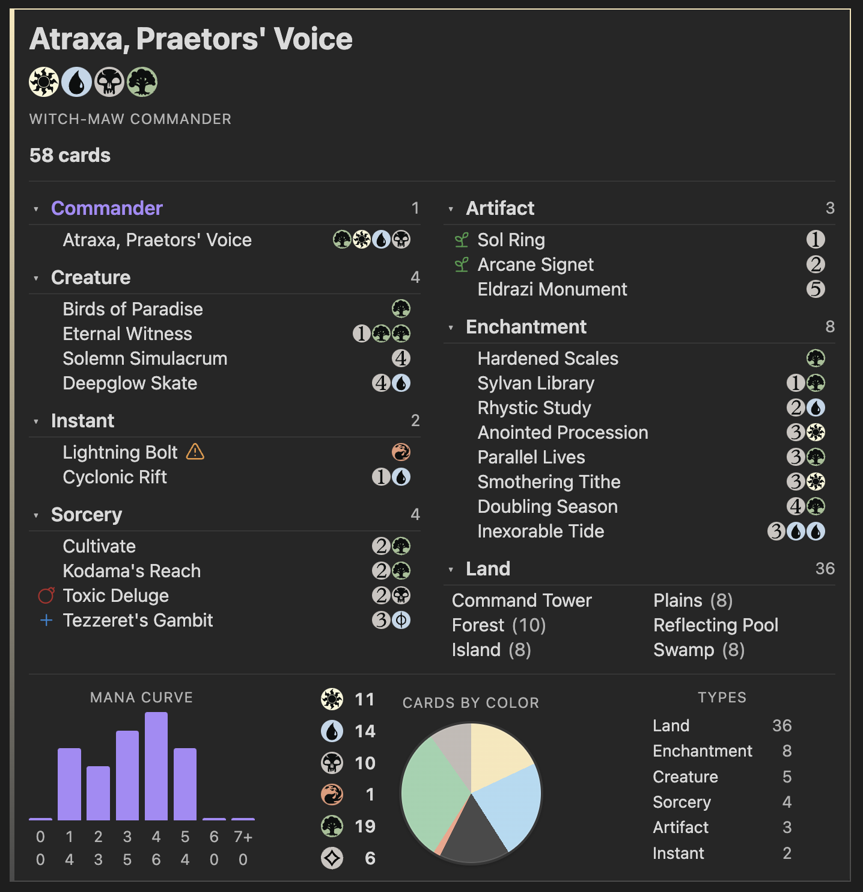
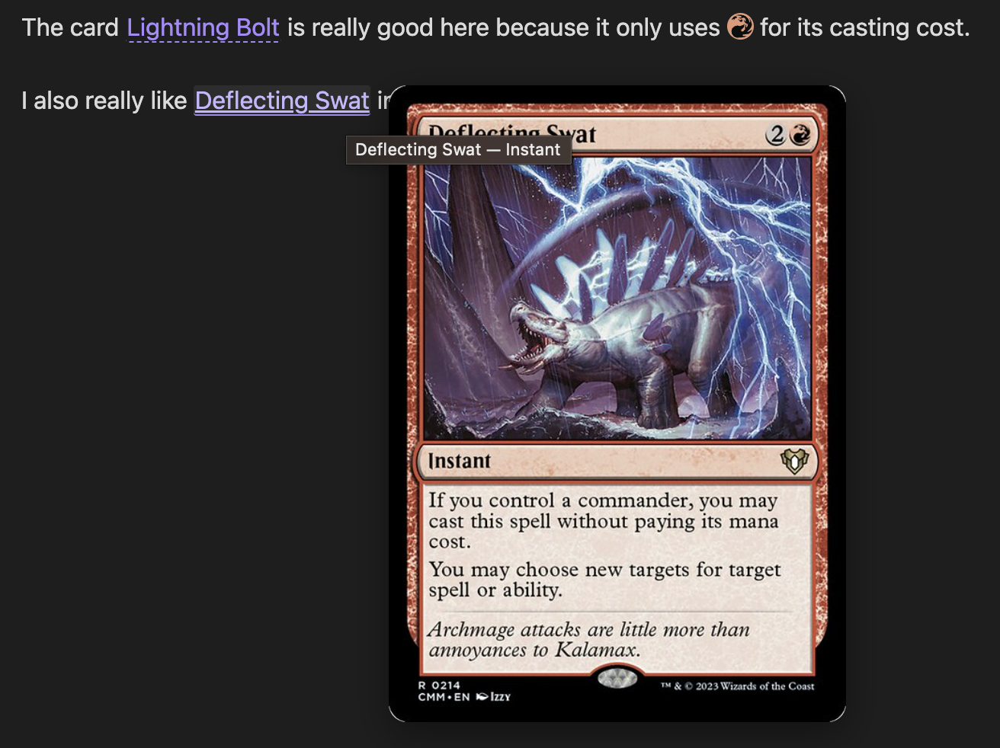

# MTG Decklist

> [!NOTE]
> This is my first Obsidian plugin, so expect a few rough edges.
> Bug reports, feature requests, and PRs are all hugely appreciated.

An [Obsidian](https://obsidian.md) plugin that turns fenced ` ```decklist ` code blocks into rich, Moxfield-style Magic: The Gathering decklists with Scryfall card data, hover/tap image previews, and at-a-glance deck stats. It also lets you sprinkle inline mana symbols and hoverable card links throughout your regular notes.





> Card data and images are fetched from the public [Scryfall API](https://scryfall.com/docs/api). This plugin is unofficial fan content not affiliated with Wizards of the Coast.

## Features

- **Decklist code blocks** – Paste a Moxfield-style list inside a ` ```decklist ` block and it renders as a styled deck panel.
- **Auto grouping** – Group cards automatically by type (Commander, Creature, Instant, Sorcery, Artifact, Enchantment, Planeswalker, Land, …) or honour your own `# Section` headers.
- **Sorting** – Sort within each section by name, by CMC then name, or keep the order you typed.
- **Card previews** – Hover (desktop) or tap (mobile) any card name for a full Scryfall image preview. On mobile, inline card taps show the preview only; use **Open on scryfall** in the overlay to open the site (avoids the browser stealing the tap).
- **Color identity & legality warnings** – Inline icons flag cards that break the deck's color identity or are not legal in your chosen format.
- **Card role tags** – Manually tag cards with roles like `#ramp`, `#draw`, `#removal`, `#boardwipe`, `#counterspell`, `#wincon` (and your own custom tags) — each shows up as a small coloured icon next to the card name.
- **Deck stats** – Mana curve, cards-by-color pie, and type breakdown rendered under the list.
- **Commander-aware header** – Detects a `# Commander` section, shows the commander name, the deck's color combo (Azorius, Esper, Witch‑Maw, …), color pips, and total card count.
- **Sideboard / maybeboard** – `# Sideboard`, `# SB`, `# Maybeboard`, `# Maybe` sections render separately and can start collapsed.
- **Inline mana symbols** – Type things like `{2}{W}{U}` in any note and they render as Scryfall mana icons (works in Reading view and Live Preview).
- **Inline card links** – `` `mtg:Lightning Bolt` `` or `[Bolt](mtg:Lightning Bolt)` become hoverable card links (desktop: click opens Scryfall; mobile: tap shows preview, then **Open on scryfall** in the overlay).
- **Combo blocks** – Document combos in their own ` ```combo ` block: prerequisites, ordered steps, an optional loop diagram with a back-arrow for cyclical combos, "break out" steps, counterplay notes, optional `infinite:` tags on the combo or per line, and multi-line variants.
- **Moxfield import** – Drop a public Moxfield deck URL into a `decklist` block and the plugin fetches the cards for you. A small refresh button in the deck header (and a command) re-pulls the latest version.
- **Exporters** – Copy the decklist under your cursor as Moxfield text or as an MTG Arena import via the command palette.
- **Local cache** – Card data, Scryfall mana symbology, and fetched Moxfield decks are cached on disk so re-renders are instant and offline-friendly.

## Installation

### Manual install

1. Download `main.js`, `manifest.json`, and `styles.css` from the latest [release](../../releases).
2. Copy them into `<your-vault>/.obsidian/plugins/mtg-decklist/`.
3. In Obsidian, open **Settings → Community plugins**, refresh the list, and enable **MTG Decklist**.

### From source

```bash
git clone <this-repo> mtg-decklist
cd mtg-decklist
npm install
npm run build
```

Then copy `main.js`, `manifest.json`, and `styles.css` into your vault's plugins folder as above.

### Development

```bash
npm run dev
```

This watches `src/` and rebuilds `main.js` on every change. Reload Obsidian (or use a hot-reload plugin) to pick up new builds.

## Quick start

Create a code block with the language tag `decklist`:

````markdown
```decklist
# Commander
1 Atraxa, Praetors' Voice

# Creatures
1 Birds of Paradise
1 Eternal Witness
1 Solemn Simulacrum

# Instants
1 Cyclonic Rift

# Sorceries
1 Cultivate
1 Toxic Deluge

# Artifacts
1 Sol Ring

# Enchantments
1 Rhystic Study
1 Sylvan Library

# Lands
10 Forest
8 Island
8 Plains
8 Swamp
1 Command Tower
```
````

That single block gives you a styled Moxfield-style panel with grouped sections, hoverable card names, color identity pips, and stats below.

## Decklist syntax

Each line inside a ` ```decklist ` block is one of:

| Syntax | Meaning |
| --- | --- |
| `4 Lightning Bolt` | 4 copies of *Lightning Bolt*. |
| `1x Lightning Bolt` | The `x` after the quantity is optional. |
| `1 Sol Ring #ramp` | Tag a card with a role (see [Card role tags](#card-role-tags)). |
| `# Creatures` | A manual section header. |
| `# Commander` (or `# Commanders`) | Marks the cards under it as the deck's commander(s). |
| `# Deck` | The default "main deck" section — useful right after `# Commander` to push remaining cards back into the auto-grouped pool. |
| `# Sideboard` (or `# SB`, `# Side`) | A sideboard section. |
| `# Maybeboard` (or `# Maybe`) | A maybeboard section. |
| `// note` | A comment, ignored by the parser. |
| Blank line | Section break (purely cosmetic). |

The default grouping mode (`Respect manual, fall back to auto`) treats `# Commander`, `# Deck`, `# Sideboard`, and `# Maybeboard` as **structural** headers — they don't switch the deck into manual layout. So you can mark a commander explicitly and still get the rest of the deck auto-grouped by type:

````markdown
```decklist
# Commander
1 Atraxa, Praetors' Voice

# Deck
1 Sol Ring
1 Llanowar Elves
1 Cyclonic Rift
…
```
````

The moment you add a custom section like `# Creatures` or `# Spells`, auto-grouping switches off and the layout follows your headers exactly.

### Card role tags

Append a `#tag` token at the end of a card line to flag what role it plays in the deck. The tag becomes a small coloured icon next to the card name with a tooltip on hover. Each card supports a single tag — if you write more than one, only the first is used.

```
1 Sol Ring #ramp
1 Rhystic Study #draw
1 Swords to Plowshares #removal
1 Cyclonic Rift #boardwipe #wincon
```

Built-in tags:

| Tag | Aliases | Icon | Meaning |
| --- | --- | --- | --- |
| `ramp` | `mana-rock`, `mana-dork` | sprout | Mana acceleration |
| `draw` | `card-draw`, `cantrip`, `draw-engine`, `advantage` | plus | Card draw |
| `removal` | `spot-removal`, `kill`, `single-target` | target | Targeted removal |
| `boardwipe` | `wipe`, `sweeper`, `wrath` | bomb | Mass removal |
| `counterspell` | `counter`, `permission` | shield | Counter magic |
| `recursion` | `reanimate`, `graveyard-recursion` | rotate-ccw | Bring cards back |
| `tutor` | `tutoring`, `search` | search | Tutor effect |
| `protection` | `hexproof`, `indestructible` | shield-check | Protect your stuff |
| `wincon` | `win`, `finisher`, `threat` | trophy | Win condition |
| `combo` | `combo-piece`, `enabler` | link | Combo piece |
| `utility` | `tech` | wrench | General utility |

Any other `#tag` you invent (e.g. `#tribal-elf`, `#stax`, `#flicker`) will render with a generic tag icon and the tag name as its tooltip — so you can build your own taxonomy without changing the plugin. Tag names are case-insensitive and may contain letters, digits, hyphens, and underscores.

### Per-block directives

You can put directives at the very top of a block (before any cards or headers) to override your global settings just for that deck:

````markdown
```decklist
group: auto
sort: cmc-name

1 Lightning Bolt
1 Counterspell
1 Sol Ring
```
````

Supported keys:

| Key | Values |
| --- | --- |
| `group` (or `grouping`) | `auto`, `manual`, `respect-manual` |
| `sort` | `name`, `cmc-name`, `source` |
| `moxfield` (or `source`) | A Moxfield deck URL or public deck ID — see [Loading from Moxfield](#loading-from-moxfield). |

## Loading from Moxfield

Instead of typing out cards, you can point a `decklist` block at any **public** Moxfield deck and the plugin will fetch its contents for you:

````markdown
```decklist
moxfield: https://www.moxfield.com/decks/AbCdEf123Hij
```
````

You can also pass just the deck's public ID (`moxfield: AbCdEf123Hij`). Per-block directives like `group:` and `sort:` still work alongside `moxfield:` to override your global rendering preferences for that one deck.

The deck name shown by Moxfield becomes the panel title, and a small **Moxfield** badge plus a refresh button appear in the header. Click the refresh button to force a fresh fetch.

### Tagging cards in a Moxfield-loaded deck

Even though the card list comes from Moxfield, you can still annotate any card with [role tags](#card-role-tags) by listing it under the directive with bare `<card name> #tag` lines. The plugin matches by name (case-insensitive) against the fetched deck and merges the tags onto that card — quantities and section placement are still controlled by Moxfield.

````markdown
```decklist
moxfield: https://www.moxfield.com/decks/AbCdEf123Hij

Sol Ring #ramp
Rhystic Study #draw
Cyclonic Rift #removal #boardwipe
```
````

If a tag annotation references a name that isn't in the Moxfield deck, you'll get a parse warning at the top of the rendered block so you know it didn't take effect. Double-faced and split cards can be referenced by their front-face name (e.g. `Brightclimb Pathway #ramp` will match Moxfield's `Brightclimb Pathway // Grimclimb Pathway`).

**Caching**: Fetched decks are cached locally so re-renders are instant. By default the cache is considered fresh for 6 hours; tweak this with **Settings → MTG Decklist → Moxfield cache lifetime (minutes)**, or invalidate a specific deck with the **Refresh Moxfield deck under cursor** command. **Clear Moxfield deck cache** wipes everything.

**Caveats**:

- Only **public** decks work — private decks would need a Moxfield account, which this plugin doesn't support.
- Moxfield's API is undocumented and could change without notice. If a fetch fails, you'll see an inline error with the original URL and a retry button.
- Card identity is still resolved via Scryfall by name, so you'll get whatever printing Scryfall returns rather than the exact set/foil that Moxfield has on file.
- Be respectful of Moxfield's service — don't aggressively shorten the cache TTL or hammer the refresh button. Use this feature at your own risk.

## Combo blocks

Document your favourite combos with a structured ` ```combo ` block. It supports linear "do A, then B, then win" combos as well as cyclical loop combos rendered as a small flow diagram with a curved back-arrow on the left.

### Linear combo

````markdown
```combo
name: Thoracle / Consultation
result: Win the game

prerequisites:
  - `mtg:Thassa's Oracle` on the battlefield
  - `mtg:Demonic Consultation` in hand
  - {1}{U}{B} available

steps:
  - Cast {1}{B} `mtg:Demonic Consultation`, naming a card not in your deck.
  - Exile your entire library searching for that card.
  - Trigger or cast `mtg:Thassa's Oracle`.
  - On the ETB trigger, your library is empty so you win the game.

interact:
  - Counter `mtg:Thassa's Oracle` on the stack.
  - Force a shuffle effect before the trigger resolves.
```
````

### Loop combo

````markdown
```combo
name: Splinter Twin + Deceiver Exarch
result: Infinite hasty 1/4 flying tokens — attack for the win

prerequisites:
  - `mtg:Deceiver Exarch` (or `mtg:Pestermite`) on the battlefield, untapped
  - `mtg:Splinter Twin` enchanting that creature

loop:
  - Tap the enchanted creature to activate its `mtg:Splinter Twin` ability, creating a non-legendary token copy with haste.
  - The token enters; its `mtg:Deceiver Exarch` ETB triggers, untap the original creature.
  - The original is untapped again — repeat for as many hasty tokens as you want.

break:
  - Stop activating once you have lethal on board, then declare attackers.
  - The tokens are sacrificed at the next end step, so swing the same turn.

interact:
  - Kill `mtg:Deceiver Exarch` or remove `mtg:Splinter Twin` in response to an activation.
  - Counter the activated ability with something like `mtg:Spell Pierce`.
  - Tap the creature down before the activation resolves.

notes:
  - Works the same with `mtg:Pestermite`, `mtg:Zealous Conscripts`, or any "ETB: untap target permanent" creature.
```
````

### Combo syntax

| Key | Type | Notes |
| --- | --- | --- |
| `name` | text | Required. The combo's title. |
| `result` | text | Optional. What the combo achieves. |
| `infinite` | flag | Optional. When `true`, `yes`, or empty after the colon, shows an **∞** badge on the combo header. Use `false` / `no` / `off` / `0` to turn off. Applies to the **top-level** combo when written before any `line:`; after a `line:` header it tags **that variant** only. |
| `battlefield` | list | Cards / permanents that must already be in play. |
| `hand` | list | Cards needed in hand (or library, graveyard, etc.) to assemble the combo. |
| `prerequisites` | list | Other conditions (mana available, life total, graveyard size, …). |
| `steps` | list | A linear sequence (rendered as a numbered list). |
| `loop` | list | A cyclical sequence (rendered as a flow diagram). |
| `break` | list | Ways to exit the loop on purpose. |
| `interact` | list | How an opponent can disrupt the combo. |
| `notes` | list | Extra context. |
| `line` | header | Optional. Starts a new variant — see [Combo lines / variants](#combo-lines--variants) below. |

List items use `- ` (one per line). Aliases are accepted: `prereqs`, `step`, `cycle`, `disrupt`, `outcome`, `win`, `in-play` / `board` / `field` (= `battlefield`), `in-hand` / `cards` / `pieces` (= `hand`), `variant` / `variants` (= `line`), `inf` / `infinity` (= `infinite`), etc. Lines starting with `//` are comments. Any text inside any field can use the inline syntaxes:

- `{R}`, `{2}{U}`, `{W/U}`, `{S}` … for mana symbols.
- `` `mtg:Card Name` `` (in backticks) for a hoverable card link — same syntax as in regular notes.
- `[Display](mtg:Card Name)` for a hoverable link with custom display text.

> Use the backtick form so the card name's boundaries are unambiguous (e.g. `` `mtg:Worldgorger Dragon` in graveyard `` correctly links *Worldgorger Dragon* and leaves "in graveyard" as plain text).

### Combo lines / variants

When the same combo can fire with several different supporting cards, define a shared shell at the top of the block and then list each variant after a `line:` header. Everything that follows a `line:` header (battlefield / hand / prerequisites / steps / loop / break / notes) belongs to that variant until the next `line:` (or the end of the block).

````markdown
```combo
name: Curiosity Effects + Vivi Ornitier
result: Draw 3 cards per noncreature spell cast

battlefield:
  - `mtg:Vivi Ornitier`

steps:
  - Cast a noncreature spell.
  - `mtg:Vivi Ornitier` triggers and pings the opponent.
  - The "draw on damage" effect triggers; you draw cards.

notes:
  - Scales with storm turns and cheap noncreature spells.

line: Curiosity package
hand:
  - `mtg:Curiosity`, `mtg:Tandem Lookout`, or `mtg:Ophidian Eye`
notes:
  - Each draws 3 cards per Vivi ping.

line: Niv-Mizzet, Visionary
battlefield:
  - `mtg:Vivi Ornitier`
  - `mtg:Niv-Mizzet, Visionary`
notes:
  - Niv-Mizzet's own ability is the draw trigger — no enchantment required.

line: Embereth Blaze
hand:
  - `mtg:Embereth Blaze`
notes:
  - Exiles 3 cards off the top instead of drawing — useful as a wincon vs combo decks.
```
````

Each line renders as its own mini-card under the main combo, auto-numbered "Line 1", "Line 2", … with the optional name shown next to the badge. Lines may carry `battlefield`, `hand`, `prerequisites`, `steps`, `loop`, `break`, `notes`, and `infinite` (shows an **∞** badge on that line’s header). `interact` always applies to the top-level combo regardless of where it appears in the source.

## Inline mana symbols

When **Render inline mana symbols** is enabled (default), mana tokens written in regular note text are replaced with Scryfall icons in both Reading view and Live Preview:

```markdown
Lightning Bolt costs {R} and deals 3 damage. Cyclonic Rift overload is {1}{U}.
```

Supports the standard Scryfall token syntax: `{W}`, `{U}`, `{B}`, `{R}`, `{G}`, `{C}`, `{X}`, generic numbers `{0}`–`{20}`, hybrid `{W/U}`, Phyrexian `{W/P}`, and snow `{S}`. In Live Preview the raw source reappears whenever your cursor enters the token, so editing stays natural.

## Inline card links

When **Render inline card links** is enabled (default), two syntaxes become hoverable card links:

- `` `mtg:Lightning Bolt` `` – an inline code span starting with `mtg:`.
- `[Bolt](mtg:Lightning Bolt)` – a Markdown link with the `mtg:` protocol (the link text is shown).

**Desktop:** hover the link for an image preview; click the link to open the card on Scryfall. **Mobile:** tap the link for a full-screen image preview; tap **Open on scryfall** below the art to open the site, or tap the dimmed backdrop to dismiss.

## Settings

Available under **Settings → Community plugins → MTG Decklist**:

- **Grouping mode** – `Respect manual, fall back to auto` (default), `Auto (by card type)`, or `Manual (only your headers)`.
- **Sort within group** – `Name (alphabetical)` (default), `CMC, then name`, or `Source (as typed)`.
- **Image quality** – Size of card preview images: `Small`, `Normal`, `Large`.
- **Hover delay (ms)** – Delay before previews appear on desktop hover.
- **Collapse sideboard by default** – Sideboard and maybeboard sections start collapsed.
- **Show deck stats** – Toggle the mana curve / colors / types panel below decklists.
- **Legality warnings** – Flag cards that aren't legal in `Standard`, `Pioneer`, `Modern`, `Legacy`, `Vintage`, `Pauper`, `Commander`, or `Brawl`.
- **Render inline mana symbols** – Toggle inline `{R}`-style replacement.
- **Render inline card links** – Toggle inline `mtg:` link rendering.
- **Moxfield cache lifetime (minutes)** – How long fetched Moxfield decks stay cached before being refetched (default 6 hours).
- **Card cache** – Shows how many cards are cached and offers a one-click clear.
- **Moxfield deck cache** – Shows how many Moxfield decks are cached and offers a one-click clear.

## Commands

Available from the command palette:

- **Insert Decklist template at cursor** – Drops a starter ` ```decklist ` block at the cursor.
- **Copy Decklist under cursor as Moxfield text** – Copies the deck under your cursor in a Moxfield-friendly plain-text format.
- **Copy Decklist under cursor as Arena import** – Copies the deck under your cursor in MTG Arena import format.
- **Refresh Moxfield deck under cursor** – Invalidates the cached copy of the Moxfield deck under the cursor so it re-fetches on next render.
- **Clear Moxfield deck cache** – Wipes all cached Moxfield deck responses.
- **Clear card cache** – Wipes the on-disk card and symbology cache.

## Privacy & data use

- Card data and mana symbology are fetched on demand from the public Scryfall API (`https://api.scryfall.com`) only when an unknown card is encountered.
- Card images are loaded directly from Scryfall's CDN when you hover a card.
- When a `decklist` block uses `moxfield:`, the **only** request to Moxfield is a single GET to `https://api2.moxfield.com/v3/decks/all/<public-id>`. No account or credentials are involved, and only the public deck ID you typed leaves your machine.
- No telemetry. Nothing about your notes or vault contents is sent anywhere.
- All fetched data (card details, mana symbology, Moxfield deck responses) is cached locally inside the plugin's own data file under your vault.

Please be considerate of Scryfall's and Moxfield's free services and their respective API guidelines.

## Acknowledgements

- [Scryfall](https://scryfall.com) for their excellent free card API and mana symbology assets.
- [Moxfield](https://www.moxfield.com) for their public deck pages, which the optional `moxfield:` directive relies on.
- The Obsidian team for the [plugin API](https://docs.obsidian.md).
- Magic: The Gathering is © Wizards of the Coast. This plugin is unofficial fan content and is not produced, endorsed, supported, or affiliated with Wizards of the Coast.

## License

This plugin is released under the **GNU General Public License v3.0 or later**. See [LICENSE](LICENSE) for the full text.

[](https://ko-fi.com/Z8Z31YAERO)

